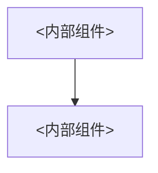

# 模块文档模板（sysdocs-module-template）

`SysDocs/modules/<module-id>.md` 的生成模板。`page`（`SysDocs/modules/<module-id>/<page-id>.md`）复用本模板的章节形状和自检清单，仅增加 `page_id` / `module_id` 及页面归属字段。

## frontmatter（载入即校验）

```yaml
---
schema: 1
doc_type: module
module_id: <module-id>      # 与 overview manifest 的 id 精确一致
status: draft
generated_from: <git sha or null>
source_scope: committed | committed+working-tree | unversioned
updated: <ISO-8601>
confidence: high | low
kb: codegraph | understand-anything | graphify | none
owned_by: agent | mixed
---
```

`page` 的 frontmatter 额外包含：

```yaml
doc_type: page
module_id: <module-id>
page_id: <page-id>         # 模块内唯一，出现在对应模块 pages 列表
```

## 0. 关联模块列表

【人读摘要 ≤5 行】本模块与哪些模块有依赖/被依赖/协作关系，每个关联写具体接口/消息/数据。

| 关联模块 | 方向 | 具体接口 / 消息 / 数据 |
|---|---|---|
| `<module>` | 依赖 / 被依赖 / 协作 | `<具体接口名、消息类型、数据结构>` |

> 相关性从知识库读取（Understand-Anything 的模块级 import graph / community）；知识库无相关性时由 AI 从源码调用关系推断。

## 1. 设计结构

【人读摘要 ≤5 行】本模块职责、内部组成、关键设计决策。



- 职责：<一句话>
- 关键设计决策：[ADR-NNN](<path>) — <决策>

## 2. 执行流程

【人读摘要 ≤5 行】核心流程一句话。

| 步骤 | 类.方法 | 输入 | 动作 | 输出 | 异常分支 |
|---|---|---|---|---|---|
| 1 | `ns::Svc::place(string)` | `<input>` | `<动作>` | `<output>` | `<异常>` |

> 符号引用使用 `语言|路径:类.方法(签名)` 形式；匿名结构（lambda/闭包/回调/管道/中间件/handler）豁免并退回「最近具名符号 + 上下文 + 代码片段」。

## 3. 类与文件引用（分级）

【人读摘要 ≤5 行】公开 API 详写，内部实现类一览表；禁止每个类都详写。单模块硬顶：约 400 行或详写类 ≤ 15 个（先到为准）。

### 详写（公开 API、跨模块边界类型）

| 全限定名 | 路径 | 职责 | 公开接口 | 依赖 / 被依赖 |
|---|---|---|---|---|
| `ts\|src/foo.ts:OrderService` | `src/foo.ts` | 订单核心服务 | `place(string):Order` | 依赖 `OrderRepo` |

### 一览表（模块内部实现类）

| 名 | 路径 | 一句话职责 |
|---|---|---|
| `OrderRepo` | `src/order/repo.ts` | 订单持久化 |

> 超出硬顶 → 拆 `modules/<module-id>/` 子页，或标「内部实现详见源码」并给出目录路径。

## 4. 使用条件

【人读摘要 ≤5 行】运行前提、初始化装配、调用约束。

- 运行前提：<条件>
- 初始化装配：<装配方式>
- 调用约束：<约束>

## 5. 限制规则

【人读摘要 ≤5 行】本模块的硬约束、边界容量、已知局限。

- MUST：<必须>
- MUST NOT：<禁止>
- SHOULD：<建议>
- 边界容量：<阈值 + 单位>
- 已知局限：<局限>

---

## human 块示例

```html
<!-- human:start -->
…人写的约束 / 已知坑 / 业务背景，agent 不得改动…
<!-- human:end -->
```

存在任一 human 块时 frontmatter `owned_by: mixed`。

---

## 自检清单（8 条规则）

- [ ] 1. 引用唯一可定位：每个符号引用均为 `语言|路径:全限定名`，反查可命中；匿名结构已豁免并注明
- [ ] 2. 术语唯一：术语只在 `SYSTEM_ROOT.md` §0 定义，本文件只引用不重定义
- [ ] 3. 数值具体：阈值/超时/重试均写具体值 + 单位
- [ ] 4. 枚举穷举：状态/模式/错误码列全部取值
- [ ] 5. 强度分级：约束用 MUST / MUST NOT / SHOULD / MAY
- [ ] 6. 流程写清参与者：每步标 类.方法 → 输入 → 动作 → 输出 → 异常
- [ ] 7. 条件写前提与违反行为
- [ ] 8. 本清单逐项打勾
- [ ] 文档预算：≤400 行且详写类 ≤15（先到为准），未超或已拆子页/标注「详见源码」
