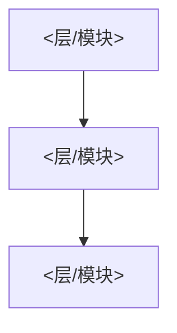
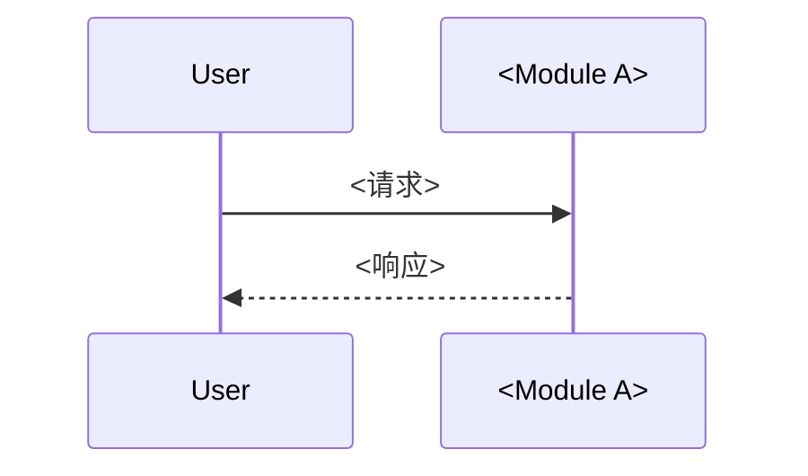

# 总文档模板（sysdocs-overview-template）

`SYSTEM_ROOT.md` 的生成模板。每一节遵循「≤5 行人读摘要 → 符号表 / Mermaid」双层形状。术语只在本文件 §0 定义一次，模块文档只引用不重定义。

## frontmatter（载入即校验）

```yaml
---
schema: 1
doc_type: overview
status: draft
generated_from: <git sha or null>
source_scope: committed | committed+working-tree | unversioned
updated: <ISO-8601>
confidence: high | low
kb: codegraph | understand-anything | graphify | none
owned_by: agent | mixed
kb_bootstrap: pending | done
modules:
  - id: <module-id>
    path: modules/<module-id>.md
    description: <一句话职责，面向人阅读>
    source_roots: [<src dir>]
    status: active
    pages: []
---
```

`overview` 必须包含 `modules` manifest 和 `kb_bootstrap`。`modules` 是唯一机器事实源；§3 表格仅由它生成。

## §0 术语表（定义一次）

| 术语 | 定义 |
|---|---|
| `<term>` | `<唯一权威定义>` |

约定：本表是术语的唯一定义处。模块文档引用术语时不得重定义。若项目非 TypeScript/JS/Python/C++/C# 之一，在此注明符号引用约定（见体系约定 §7）。

## §1 架构风格

【人读摘要 ≤5 行】项目采用的架构风格、分层、依赖方向一句话说明。



- 依赖方向：`A → B`（只允许 `A` 依赖 `B`，禁止反向/成环）
- ADR 链接：[ADR-NNN](<path>) — <决策>

## §2 端到端主流程

【人读摘要 ≤5 行】主流程一句话。

| 步骤 | 发起模块 | 动作 | 输出 | 异常 |
|---|---|---|---|---|
| 1 | `<module>` | `<动作>` | `<输出>` | `<异常分支>` |



## §3 模块清单（= 模块索引）

【人读摘要 ≤5 行】模块清单由 frontmatter `modules` manifest 生成，不得手工维护第二份事实源。

| 模块 id | 路径 | 职责 | source_roots | 状态 |
|---|---|---|---|---|
| `order-service` | `modules/order-service.md` | 订单创建/流转/持久化 | `src/order` | active |

## §4 语言与版本

| 语言 | 版本 | 用途 |
|---|---|---|
| `<lang>` | `<ver>` | `<用途>` |

## §5 运行环境

- OS：`<os>`
- 运行时：`<runtime> <version>`
- 外部依赖：`<service>`
- 环境变量（**只写变量名和用途，禁止写值**）：`VAR_NAME` — 用途

## §6 配置文件格式

| 配置文件 | 位置 | 格式 | 关键项 | 加载优先级 |
|---|---|---|---|---|
| `<file>` | `<path>` | `<format>` | `<key>` | `<优先级>` |

## §7 项目目录结构

【人读摘要 ≤5 行】带职责说明的目录树；记录 workspace 边界（monorepo 时）。

```text
project-root/
├── src/<module>/     # <职责>
├── ...
```

> §4–§7 不复制根 `README.md`：已在 README 写过的，这里只写差异 + 链接。禁止第三份会漂的项目概述。

---

## 自检清单（8 条规则）

- [ ] 1. 引用唯一可定位：每个符号引用均为 `语言|路径:全限定名`，反查可命中；匿名结构已豁免并注明
- [ ] 2. 术语唯一：术语只在 §0 定义，正文引用不重定义
- [ ] 3. 数值具体：阈值/超时/重试均写具体值 + 单位
- [ ] 4. 枚举穷举：状态/模式/错误码列全部取值
- [ ] 5. 强度分级：约束用 MUST / MUST NOT / SHOULD / MAY
- [ ] 6. 流程写清参与者：每步标发起模块 → 动作 → 输出 → 异常
- [ ] 7. 条件写前提与违反行为
- [ ] 8. 本清单逐项打勾
