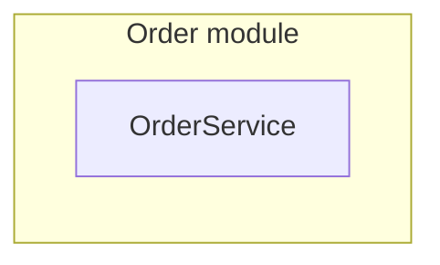
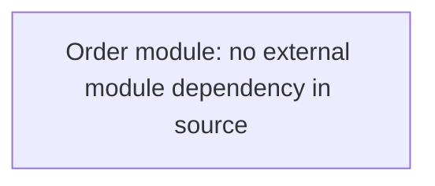

# Project map

## 检索摘要

`OrderService.create` returns the pending state. The fixture has one source module.

## 当前项目架构图

[Module responsibilities](architecture/modules/order.md).

## 模块执行流程图

[Source](../src/order/service.py), entry `OrderService.create`.

## 模块关系图

No cross-module edge exists in this fixture's source.

## 项目工作流

Not applicable: this fixture has no project automation or documented delivery workflow.
